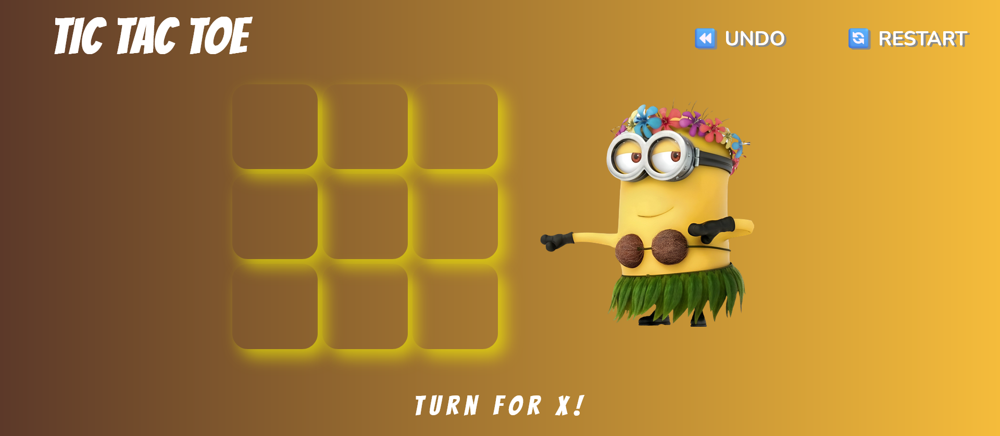

# Tic Tac Toe Game

This simple web-based Tic Tac Toe game is built with basic HTML, CSS, and JavaScript, enabling two players to play interactively on the same device.



**Live Demo**: [Play Tic Tac Toe here!](https://shikshakshok.netlify.app/)

## Features

- **Simple Interface**: A clean and minimalistic design for easy gameplay.
- **Two Player Mode**: Designed for two players, playing on the same device.
- **Interactive UI**: Players can click on the grid to make a move; the game automatically checks for wins or ties.

## Getting Started

These instructions will get your copy of the project up and running on your local machine for development and testing purposes.

### Prerequisites

A modern web browser is required to run this game.

### Installing

1. Clone the repository or download the ZIP file.
   ```bash
   git clone https://github.com/yourusername/Road-Map-to-Web-Dev.git
